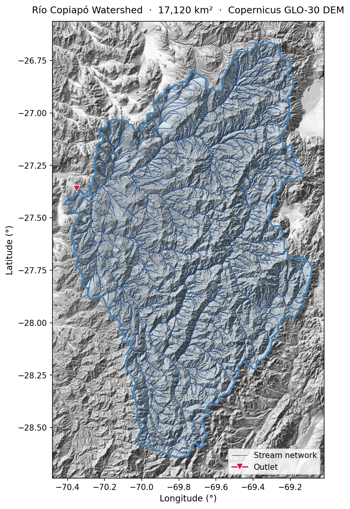

# Watershed Delineation with pysheds


A complete, reproducible Python workflow for watershed delineation and morphological analysis — applied to the **Río Copiapó basin** (Atacama Region, Chile, ~17,000 km²).



> **No credentials required.** The DEM is downloaded automatically from [Copernicus GLO-30](https://registry.opendata.aws/copernicus-dem/) (free, 30 m global coverage, served from AWS S3).

---

## What this does

1. **Download DEM** — Copernicus GLO-30 tiles for any bounding box, with local caching
2. **D8 delineation** — fill pits → fill depressions → resolve flats → flow direction → accumulation → catchment
3. **Stream network** — vectorized from D8 flow paths
4. **Morphological parameters** — 16 parameters: Gravelius, form factor, relief, slopes, drainage density, and more

---

## Outputs

| File | Description |
|------|-------------|
| `results/watershed.shp` | Watershed boundary polygon |
| `results/network.shp` | Stream network polylines |
| `results/watershed_map.png` | Publication-ready map |

---

## Quickstart

### 1. Create environment

```bash
conda env create -f environment.yml
conda activate watershed-chile
```

> **pysheds 0.3.5 + NumPy ≥ 2.0 compatibility patch** — if you see `AttributeError: module 'numpy' has no attribute 'bool8'`:
> ```bash
> python -c "
> import pysheds, pathlib, re
> p = pathlib.Path(pysheds.__file__).parent
> for f in list(p.glob('sgrid.py')) + list(p.glob('sview.py')) + list(p.glob('_sgrid.py')):
>     f.write_text(re.sub(r'np\.bool8', 'np.bool_', f.read_text()))
> print('Patch applied.')
> "
> ```

### 2. Run the notebook

```bash
cd notebooks
jupyter lab
```

Open `watershed_delineation.ipynb` and run all cells.
First run downloads ~400–600 MB of DEM tiles (cached in `cache/` for subsequent runs).

---

## Adapting to your own basin

Change three lines in the notebook:

```python
BBOX       = [-71.0, -28.5, -68.8, -26.2]  # [xmin, ymin, xmax, ymax] in WGS84
OUTLET_LON = -70.351
OUTLET_LAT = -27.361
```

Set `acc_threshold` (default: 500 cells ≈ 0.45 km²) and `crs_output` (UTM zone) to match your area.

**Tip for urban outlets**: if the delineated area is unexpectedly small, the outlet may be
in a section where DSM artifacts block D8 routing. Move it slightly to a natural reach
outside the urban footprint.

---

## Optional: BCN hydrographic network snap

For improved outlet positioning, snap to the official Chilean network (BCN Mapoteca):

1. Download "Red Hidrográfica" from [bcn.cl/siit/mapoteca](https://www.bcn.cl/siit/mapoteca)
2. Clip to your study area (the full file is ~1 GB):
   ```python
   gdf = gpd.read_file("bcn_full.shp")
   gdf.cx[-71.0:-68.8, -28.5:-26.2].to_file("data/bcn_copiapo.shp")
   ```
3. Uncomment the `snap_to_network()` call in cell 3 of the notebook

---

## Repository structure

```
watershed-chile/
├── notebooks/
│   └── watershed_delineation.ipynb   ← main tutorial
├── utils/
│   ├── delineation.py                ← DEM download + D8 delineation
│   └── morphology.py                 ← 16 morphological parameters
├── data/
│   └── copiapo_outlet.geojson        ← example outlet point
├── VERSION
├── environment.yml
└── .gitignore
```

---

## Dependencies

- [pysheds](https://github.com/mdbartos/pysheds) — D8 routing
- [rasterio](https://rasterio.readthedocs.io/) — raster I/O
- [geopandas](https://geopandas.org/) — vector data
- [shapely](https://shapely.readthedocs.io/) — geometry operations
- [matplotlib](https://matplotlib.org/) — visualization

---

## License

MIT © 2025 Rodrigo Meza L.

---

*Developed with [Claude Code](https://claude.ai/code) (Anthropic)*
